# Cocktail DB Widget

my POS4 wxWidgets Project
-------------------------
starting window:
new: on selecting one of the most common cocktails it even shows an ai generated image of the cocktail, 
pretty cool but only works statically on the very few i already added...
a list containing all created cocktails so far, stored in a very simple database you can either refresh the 
list, delete an existing cocktail from the db or add a new one, or you can open the Incredients list.

new cocktail window:
choose the name, preparation info and append all the incredients needed.

new incredient window:
add, change and delete all incredients you may need as u like.

# Preview:


# Libraries you need:

wxWidgets, sqlite3


# Getting started:

Create a folder and clone this repository to your local machine:

```sh
$git clone 
```

Navigate to the directory that contains the Makefile.txt (change the Makefile accordingly "APPLICATION := <yourProjectName>") and compile:

```sh
$make
```

then launch with:

```
$./<yourProjectName>
```

# License

This project is licensed under the MIT License. See the [LICENSE](LICENSE) file for details.
